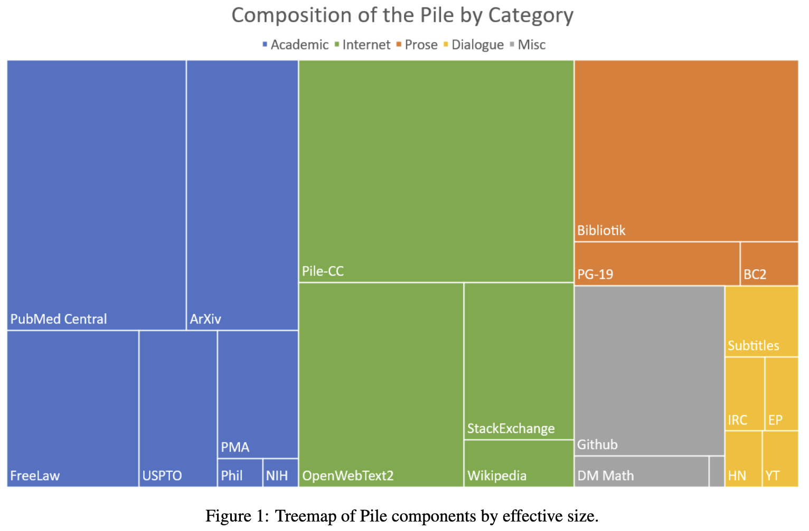
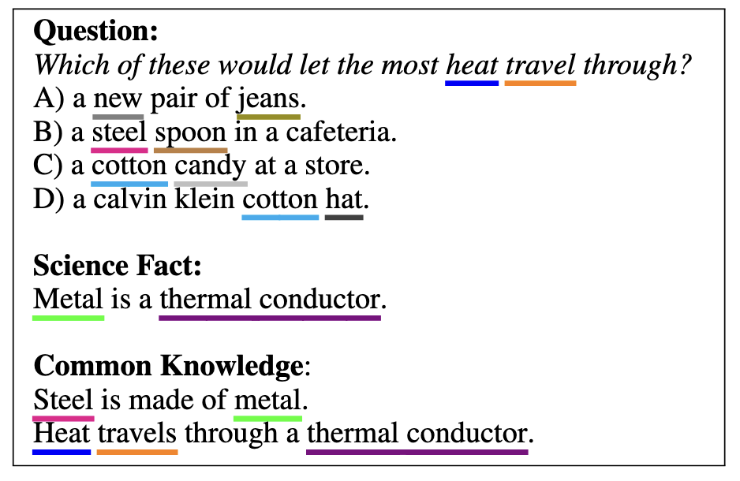

# LLM Review

## Datasets

#### 1. The Pile by EleutherAI [arXiv](https://arxiv.org/abs/2101.00027)
A 825 GiB English text corpus targeted at training large-scale language models. The Pile is constructed from 22 diverse high-quality subsets—both existing and newly constructed—many of which derive from academic or professional sources.

## Benchmarks

### Common Sense Reasoning

#### 1. Boolean Questions (BoolQ) by Google [arXiv](https://arxiv.org/abs/1905.10044)

yes/no questions dataset. Each example consists of a question (Q), an excerpt from a passage (P), and an answer (A) with an explanation added for clarity. 

#### 2. Physical Interaction: Question Answering (PIQA) by Microsoft [arXiv](https://arxiv.org/abs/1911.11641)

Given a physical goal expressed in natural language, a model must choose the most sensible solution. 

#### 3. Social Intelligence QA (SIQA) by AI^2 [arXiv](https://arxiv.org/abs/1904.09728)

Commonsense reasoning Question-answer benchmark about social situations. 

#### 4. OpenBookQA by AI^2 [arXiv](https://arxiv.org/abs/1809.02789)

Questions with a set of 1329 elementary level science facts.

