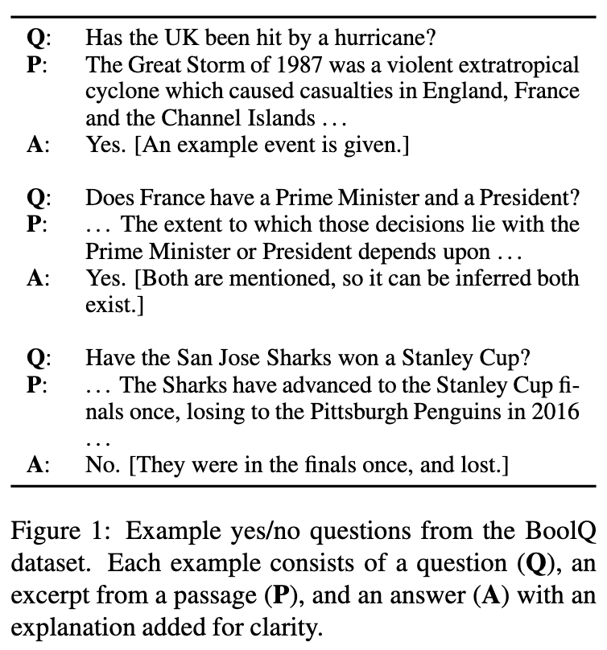
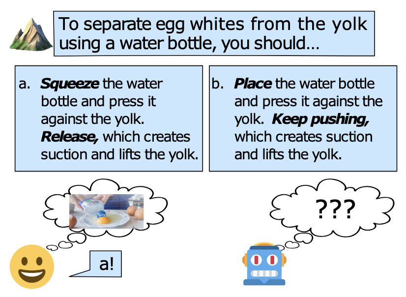
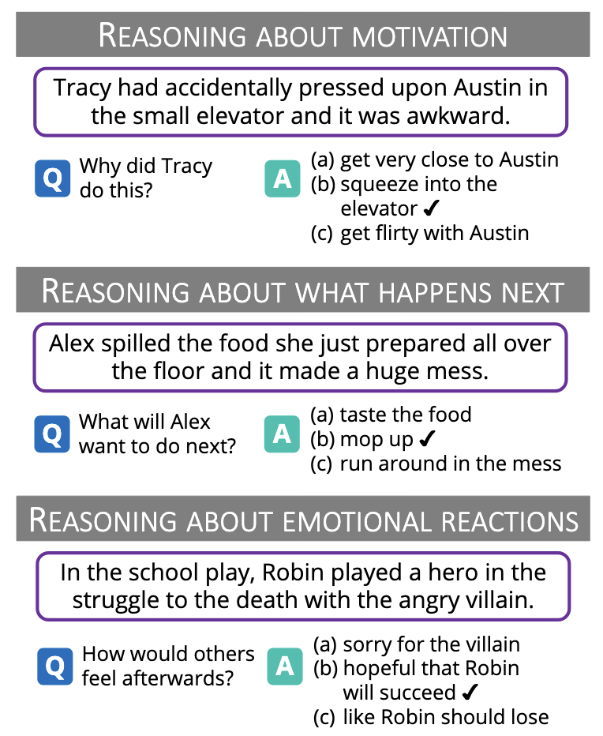

# LLM Review

## Benchmarks

### Common Sense Reasoning

1. Boolean Questions (BoolQ) by Google

yes/no questions dataset. Each example consists of a question (Q), an excerpt from a passage (P), and an answer (A) with an explanation added for clarity. [arXiv](https://arxiv.org/abs/1905.10044)

2. Physical Interaction: Question Answering (PIQA) by Microsoft

Given a physical goal expressed in natural language, a model must choose the most sensible solution. [arXiv](https://arxiv.org/abs/1911.11641)

3. Social Intelligence QA (SIQA) by AI^2

Commonsense reasoning Question-answer benchmark about social situations. [arXiv](https://arxiv.org/abs/1904.09728)

