# VLM Review

## Architecture/Training Objectives

### 1. Contrastive Language Image Pre-training (CLIP) by OpenAI [arXiv](https://arxiv.org/abs/2103.00020)
Trains on image-text pairs crawled from internet. 
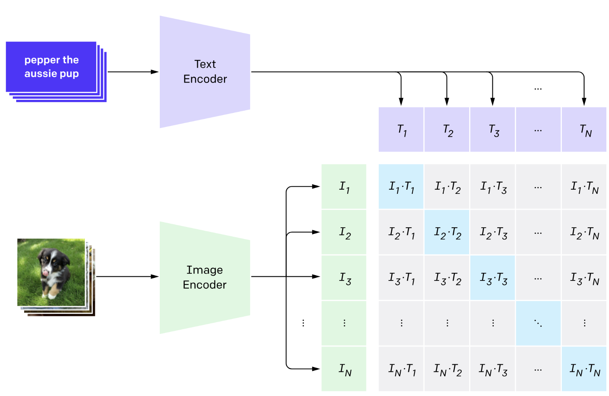

### 2. A Large-scale ImaGe and Noisy-text embedding (ALIGN) by Google Research [arXiv](https://arxiv.org/abs/2102.05918)
Trains on _Noisy_ image-text pairs crawled from internet. 

The _Noisy_ training datasets is the key difference between ALIGN and CLIP.

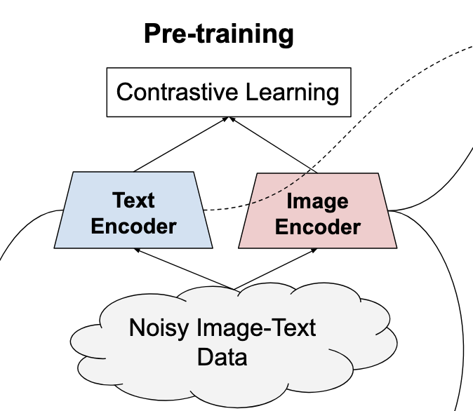

### 3. Bootstrapping Language-Image Pre-training (BLIP) by Salesforce [arXiv](https://arxiv.org/abs/2201.12086)
Train VLM with three different objectives to support both understanding-based tasks
or generation-based tasks. 

BLIP leverages three training objectives:
1. Image-Text Contrastive (ITC) like CLIP/ALIGN
2. Image-Text Matching (ITM) which is a binary cross-entropy loss to decide whether the text-image pair matches or not. The loss is applied on the [encode] token.
3. Language Modeling (LM) which is an auto-regressive objective -- like typical V/LLM -- that generates the image caption. The caption generation starts after the [decode] token.

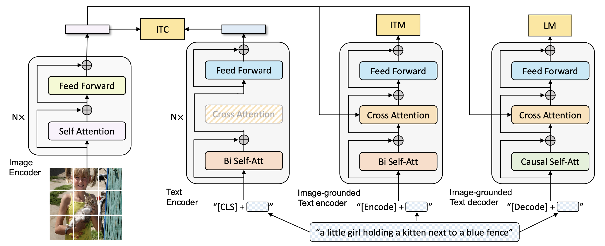

### 4. Bootstrapping Language-Image Pre-training-v2 (BLIP-2) by Salesforce [arXiv](https://arxiv.org/abs/2301.12597)
Train VLM with minimal computatinal cost (both frozen vision and LLM). 

The paper trains a Q-former between a frozne vision encoder and an LLMs. The Q-former objective is to bridge the gap between the vision and text representation. To train Q-former, the paper propose a two-stage pipeline: The first stage uses BLIP three-objectives: ITC, ITM, and LM. The first stage objective is to align vision and text represnetations. The second stage is solely a generative language modeling (LM) stage. The second stage objective is to bootstrap vision-to-language generative learning. Q-former contains two transformers that use a shared self-attention layer. The self-attention layer operates on both the learned queries and input text, but leverage different attention-masks depending on the training task (ITC, ITM, ITG).

Key observations: 
1. The Q-former can be regarded as a non-linear projection layer between the vision and text embedding which is a common approach in recent literature when training VLMs. 
2. BLIP-2 propose a two-stage training pipeline which was a new thing in 2023. Nowadays (2025), all VLMs employ a two-stage training pipeline but of course within different training objectives. The current two-stage training pipeline is usually pre-training on a large corpus of unlabeled data, before "fine-tuning" on instruction-following data.
 

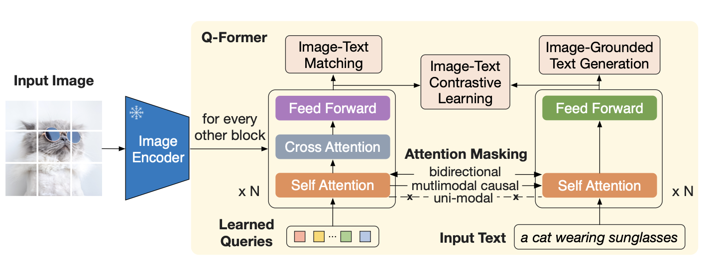
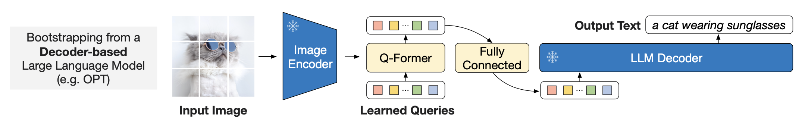

### 4. Contrastive Captioners are Image-Text Foundation Models (CoCa) by Google [arXiv](https://arxiv.org/abs/2205.01917)

CoCa is both a contrastive (text-decoder) and generative (multi-modal-decoder) architecture. Two tasks learned simultaneously. Image Encoder + **Text Decoder** trained with contrastive learning. Then, Multi-modal (image+text) **decoder** trained with a captioning task. 

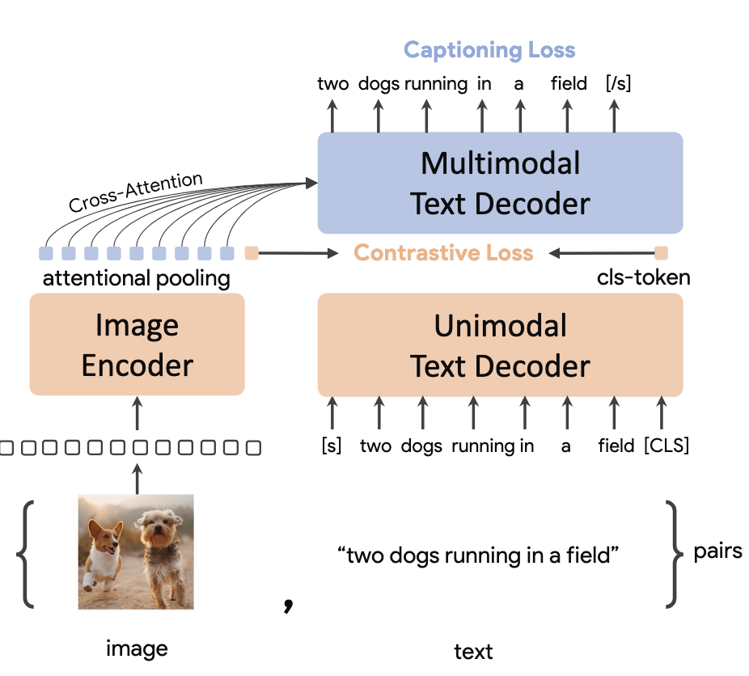

### 5. A Jointly-Scaled Multilingual Language-Image Model (PALI) by Google [arXiv](https://arxiv.org/abs/2209.06794)

Encoder-Decoder style -- like vanilla Attention Transformer -- that operates on both text and image inputs. PALI is trained using eight different supervision tasks!! This includes OCR, Captioning, VQA, Object Aware VQA, Object detection, etc.

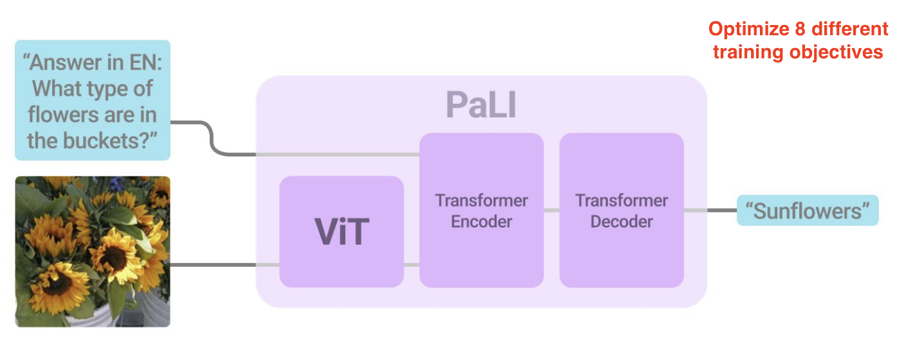

### 6. Flamingo: a Visual Language Model for Few-Shot Learning by Google [arXiv](https://arxiv.org/abs/2204.14198)

First clear attempt for VLM models with a single pre-training objective (auto-regressive learning).
This model is trained on all proprietary data.

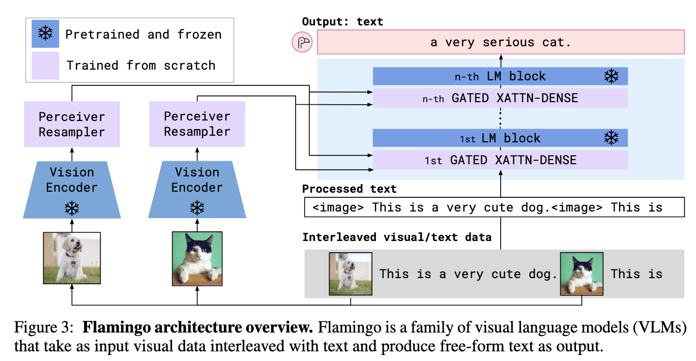

### 7. ImageBind: One Embedding Space To Bind Them All by Meta [arXiv](https://arxiv.org/abs/2305.05665)

While CLIP align image and text pairs, Image-Bind align images with other modalities such as video, depth, audio, etc. In image-bind, the image modality is the central modality that clues all other modalities togethers.

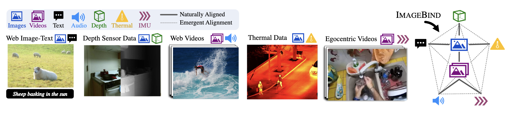

### 8. Visual Instruction Tuning by Microsoft [arXiv](https://arxiv.org/abs/2304.08485)

Standard VLM with a projection layer aligning image to text (LLM) space. The paper uses multiple stages for fine-tuning: (1) Learning the projection layer, (2) fine-tuning the projection layer and LLM, (3) [optional] instruction tuning.

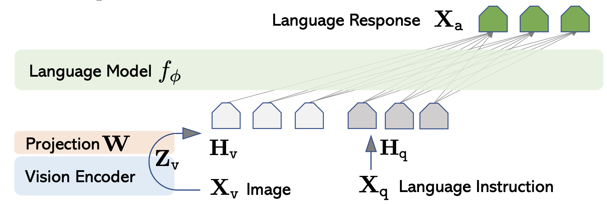

## Datasets

### 1.  Conceptual Captions 3M/12M (CC12M) by Google [arXiv](https://arxiv.org/abs/2102.08981)

A dataset with 12 million image-text pairs specifically meant to be used for visionand-language pre-training.

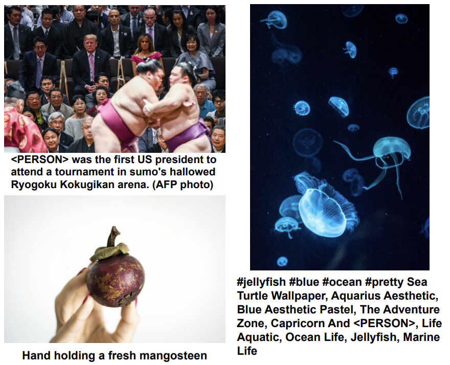

### 2. LAION-400M/5B by LAION.AI [arXiv](https://arxiv.org/abs/2210.08402)

English Img-Txt Pairs dataset

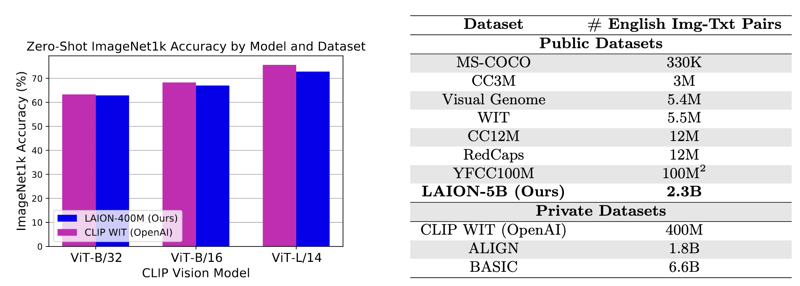

### 3. WebImageText (WIT)

English Img-Txt Pairs dataset, proprietary by OpenAI, used to train CLIP model
400 Img-Txt Pairs

### 4. YFCC100M: The New Data in Multimedia Research by Yahoo [arXiv](https://arxiv.org/abs/1503.01817)

Flickr images collected by Yahoo that contains pairs of image and metadata (title, description, etc).

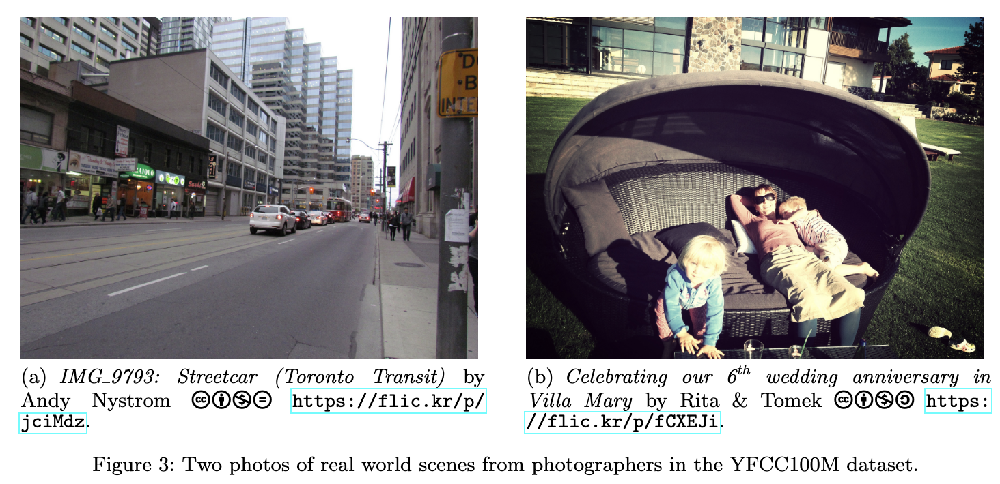

### 4. PixMO: Molmo and PixMo: Open Weights and Open Data for State-of-the-Art Vision-Language Models by Allen Institute for AI  [arXiv](https://arxiv.org/abs/2409.17146)

A multi-modal open-source dataset for training VLMs without using any synthetic data from proprietary models. Besides the standard dense caption annotations, the dataset uses point-annotation to enable grounding and counting tasks cheaply -- without using bounding box and segmentation annotation.

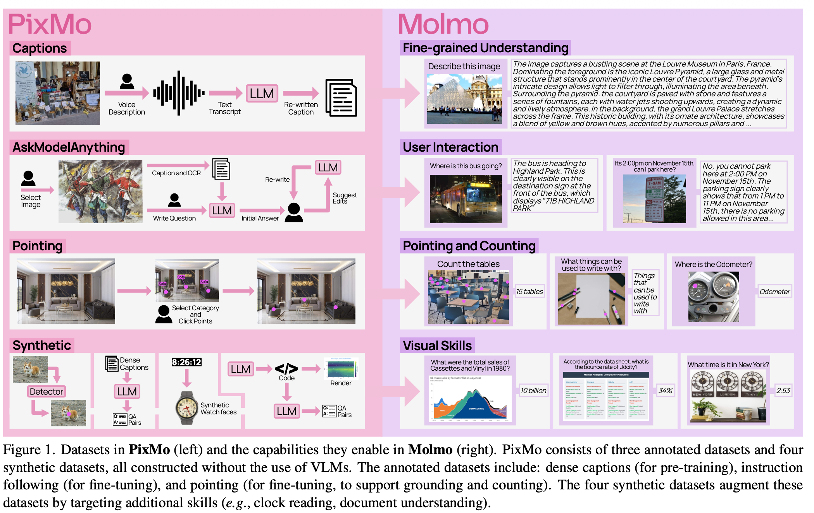

## Benchmarks

### 1. Science Question Answering (ScienceQA) by AI2 [arXiv](https://arxiv.org/abs/2209.09513)

Multimodal multiple choice questions with diverse science topics and annotations of their answers with corresponding lectures and explanations. 

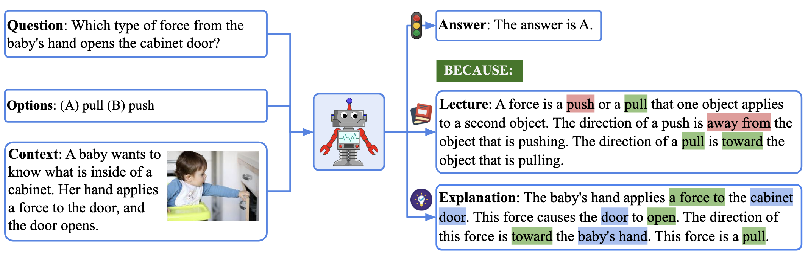

### 2. Raven IQ benchmark by Microsoft [arXiv](https://arxiv.org/abs/2302.14045)

Evaluates the capability of nonverbal reasoning for MLLMs.

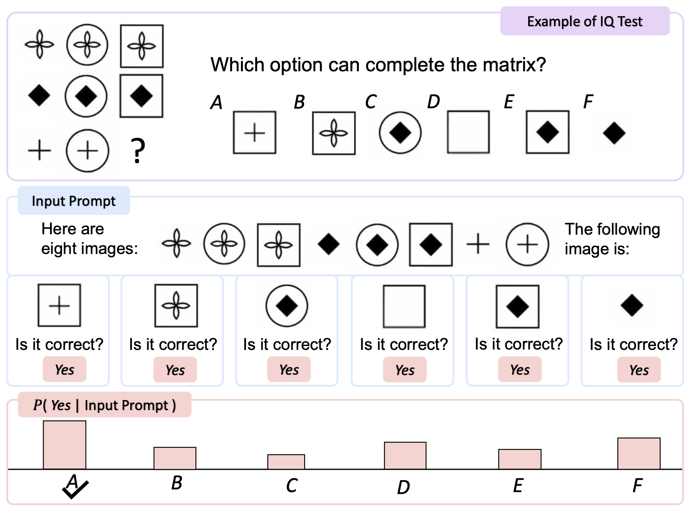

### 3. General VQAv2 benchmark by Virginia Tech, Georgia Institute of Technology [arXiv](https://arxiv.org/abs/1612.00837)

Counter language priors for the task of Visual Question Answering (VQA) and make vision (the V in VQA) matter! Specifically. Balance VQAv1 by collecting complementary images such that every question is associated with a pair of similar images but two different answers to the question.

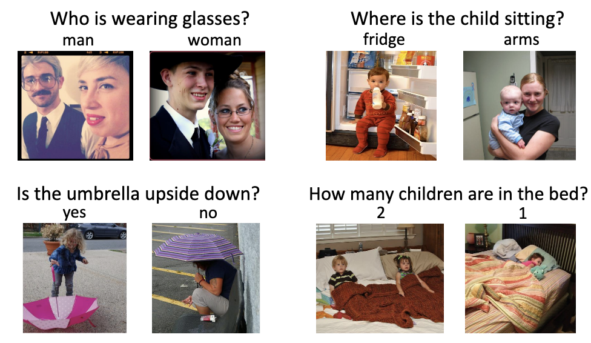

### 4. Document VQA benchmark by CVIT-India, Computer Vision Center-Spain [arXiv](https://arxiv.org/abs/2007.00398)

Visual Question Answering (VQA) on document images

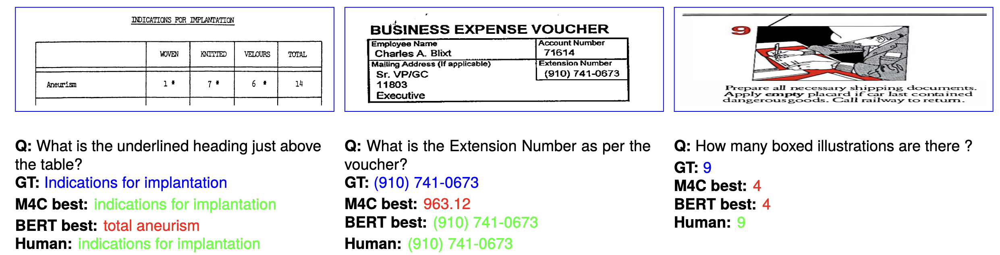

### 5. MathVista benchmark by Microsoft and UCLA [arXiv](https://arxiv.org/abs/2310.02255)

Combine mathematical and visual task. Completing these tasks requires fine-grained, deep visual understanding and compositional reasoning

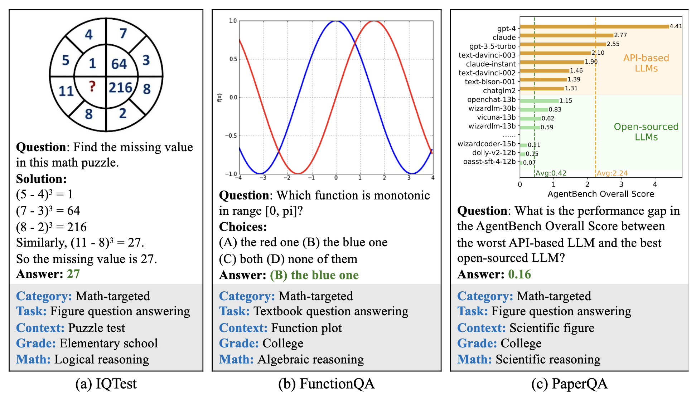

### 6. Visual Entailment benchmark by NEC Laboratories America [arXiv](https://arxiv.org/abs/1901.06706)

Also known as Stanford Natural Language Inferenc-Visual Entailment (SNLI-VE) benchmark. The task is to predict whether the image semantically entails the text.

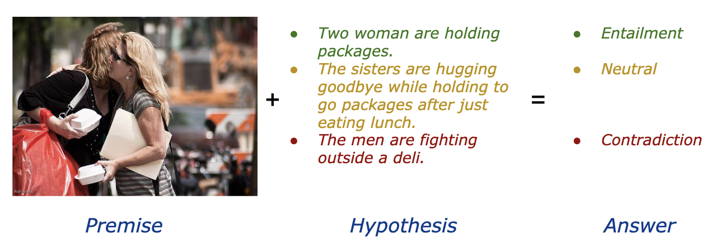

### 7. Natural Language Visual Reasoning for Real (NLVR2) by Cornell [arXiv](https://arxiv.org/abs/1811.00491)

Each caption is paired with two images. The task is to predict if the caption is True or False. The examples require addressing challenging semantic phenomena, including resolving twice . . . as to counting and comparison of objects.

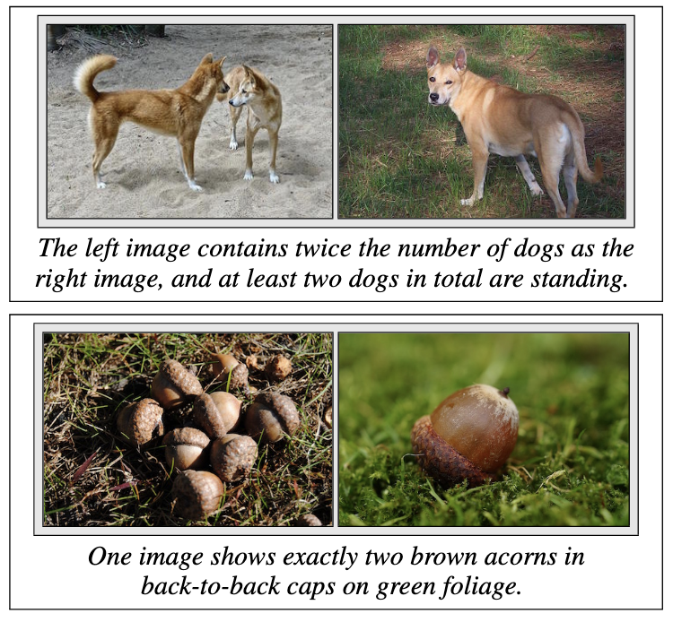

### 8. FunQA: Towards Surprising Video Comprehension (FunQA) by Beijing University [arXiv](https://arxiv.org/abs/2306.14899)

Video question answering (QA) dataset specifically designed to evaluate and enhance the depth of video reasoning based on counter-intuitive and fun videos.

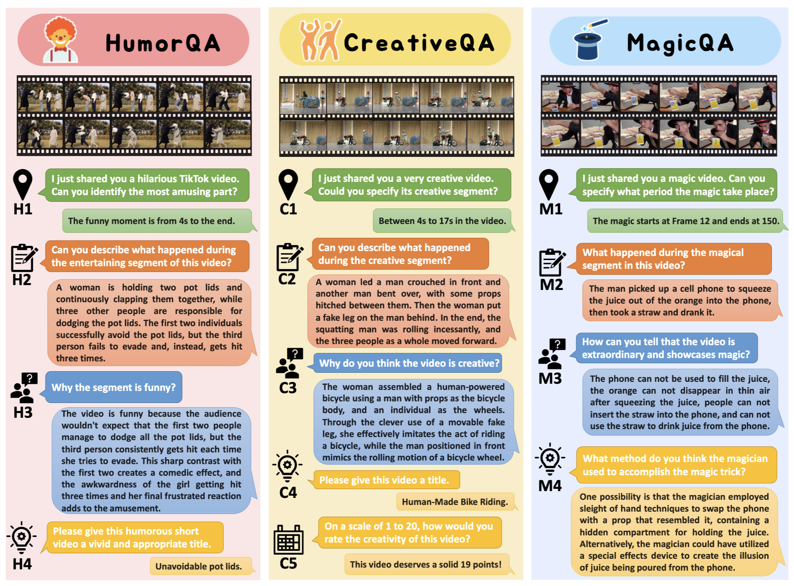

### 9. From Recognition to Cognition: Visual Commonsense Reasoning (VCR) by AI2 [arXiv](https://arxiv.org/pdf/1811.10830)

Given an image, a list of regions, and a question, a model must answer the question and provide a rationale explaining why its answer is right.

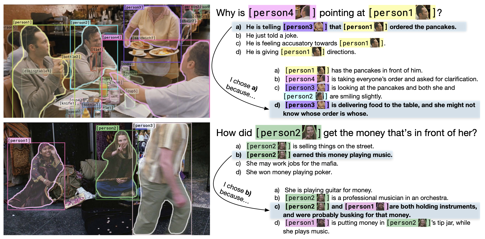

### 10. Localized, Compositional Video Question Answering (TVQA) by UNC [arXiv](https://arxiv.org/abs/1809.01696)

A largescale video QA dataset based on 6 popular TV shows: The Big Bang Theory, How I Met Your Mother, Friends, Grey’s Anatomy, House, Castle.

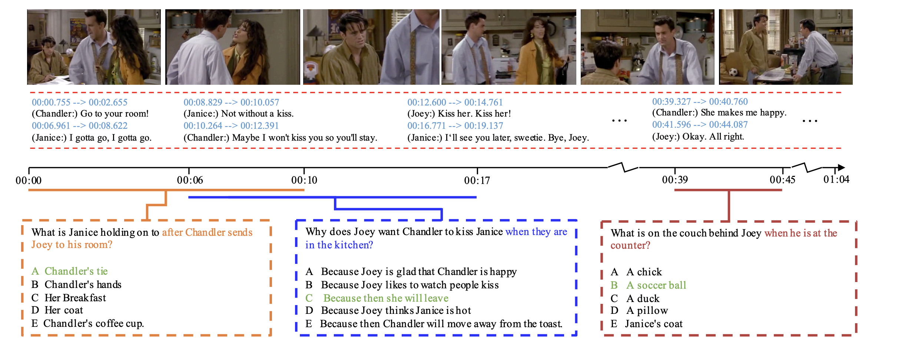

### 11. Point and Ask: Incorporating Pointing into Visual Question Answering (PointQA) by Princeton [arXiv](https://arxiv.org/abs/2011.13681)

A point-input question-answer dataset as an extension of VQA.

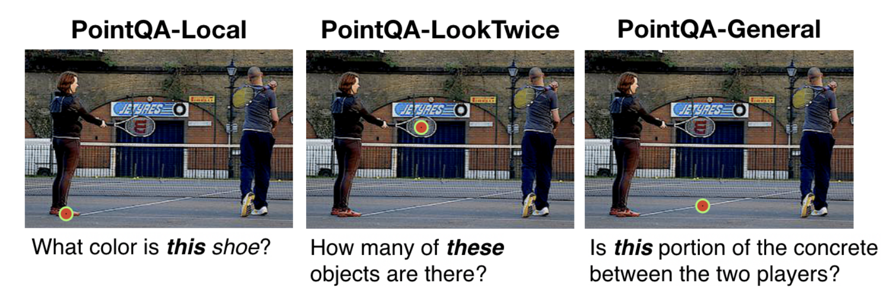

### 12. Eyes Wide Shut? Exploring the Visual Shortcomings of Multimodal LLMs (MMVP) by Meta [arXiv](https://arxiv.org/abs/2401.06209)

* Multimodal Visual Patterns (MMVP) identify CLIP-blind pairs -- images with high CLIP similarity score, but low DINOv2 score. These images are used to evaluate VLMs in a standard a Visual Question Answering (VQA) manner.

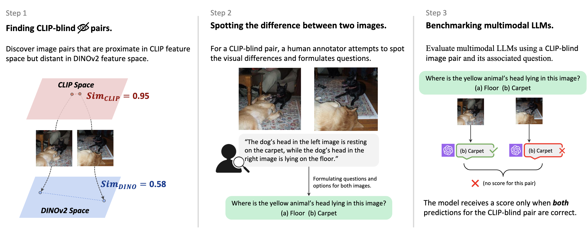

### 13. OK-VQA: A Visual Question Answering Benchmark Requiring External Knowledge by AI2 [arXiv](https://arxiv.org/abs/1906.00067)

* A VQA benchmark where the image content is not sufficient to answer the questions, encouraging methods that rely on external knowledge resources

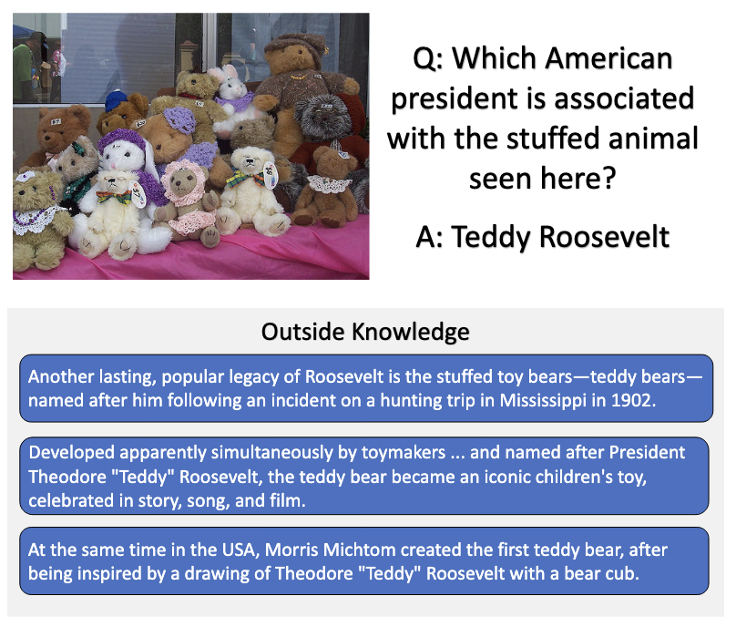

