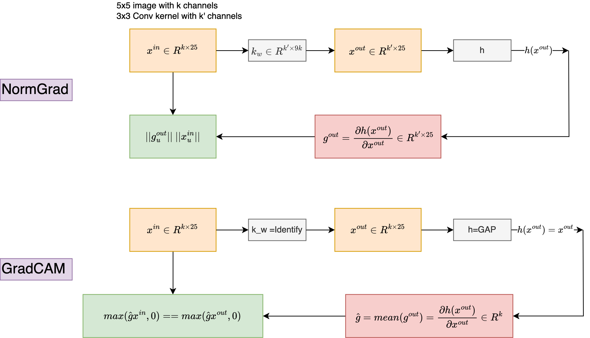

### CVPR 2020

* Don’t Judge an Object by Its Context: Learning to Overcome Contextual Bias
	> `PI_Reading_Grp` :hash:industry :hash:FB AI

* Fashion Outfit Complementary Item Retrieval
	> lsd, :hash:industry :hash:amazon

* Image Search with Text Feedback by Visiolinguistic Attention Learning
	> Technicalities	:hash:industry :hash:amazon
* Which is Plagiarism: Fashion Image Retrieval based on Regional Representation for Design Protection
	> Industry	

* Cross-Batch Memory for Embedding Learning
	> Nice!

* Proxy Anchor Loss for Deep Metric Learning
	>Proxy-NCA + Lifted Structuered; converges faster

* Moving in the Right Direction: A Regularization for Deep Metric Learning 
	> Angular loss combined with triplet loss

* Embedding Expansion: Augmentation in Embedding Space for Deep Metric Learning 
* Uninformed Students: Student–Teacher Anomaly Detection with Discriminative Latent Embeddings 
	> Nice anomaly detection application for feature embedding

* Circle Loss: A Unified Perspective of Pair Similarity Optimization 
	> Dynamic similarity weighting (similar to weighting samples hard/easy)

* Searching for Actions on the Hyperbole
	> The idea is simple and valid, but how actions are embedded? where does \phi_c(k) in eq. 10 comes from?
	
* Hyperbolic Image Embeddings
	> Interesting!
	
* RankMI: A Mutual Information Maximizing Ranking Loss
	> Interesting!	
	
* Sketch Less for More: On-the-Fly Fine-Grained Sketch Based Image Retrieval 
	> Nice RL formulation
	
* Deep Metric Learning via Adaptive Learnable Assessment
	> Nice but I think it is expensive to train the Assessor (Meta-Learning) part

* Context-Aware Attention Network for Image-Text Retrieval
	> Slow ?
	
* Central Similarity Quantization for Efficient Image and Video Retrieval 
	> Easy to read quantization paper
	

* Regularizing Class-wise Predictions via Self-knowledge Distillation
	> Simple and seems to be working

* Revisiting Knowledge Distillation via Label Smoothing Regularization
	> A network should never be over-confident about it output
* Self-training with Noisy Student improves ImageNet classification 
	> !!
* Dreaming to Distill: Data-free Knowledge Transfer via DeepInversion
	> Simple regularization approach to generate better images. Interesting experiments. :hash:industry :hash:Nvidia
* Online Knowledge Distillation via Collaborative Learning 
	> Simple	
* Distilling Cross-Task Knowledge via Relationship Matching 
	> Eq. 5 & 6	
* Explaining Knowledge Distillation by Quantifying the Knowledge 
	> Nice paper	
* Few Sample Knowledge Distillation for Efficient Network Compression 
	> Vanilla CNNs

* Large Scale Video Representation Learning via Relational Graph Clustering 
	> Technicalities for large video datasets - :hash:industry :hash:google research

* Online Deep Clustering for Unsupervised Representation Learning 
* Steering Self-Supervised Feature Learning Beyond Local Pixel Statistics
	> `PI_Reading_Grp` :hash:industry :hash:Adobe
* Same Features, Different Day: Weakly Supervised Feature Learning for Seasonal Invariance 
	> Interesting
* Unsupervised Learning from Video with Deep Neural Embeddings 
* Unsupervised Intra-domain Adaptation for Semantic Segmentation through Self-Supervision
* SpeedNet: Learning the Speediness in Videos
	> `PI_Reading_Grp` :hash:industry :hash:Google Well-written paper , related to the following papers
* OOPS: Predicting Unintentional Action in Video 
* Video Playback Rate Perception for Self-supervised Spatio-Temporal Representation Learning
	> Technicalities
* Learning Video Object Segmentation from Unlabeled Videos 
* PatchVAE: Learning Local Latent Codes for Recognition
* Towards Discriminability and Diversity: Batch Nuclear-norm Maximization under Label Insufficient Situations
	
* Scale-Equalizing Pyramid Convolution for Object Detection
	> Fuse feature pyramid levels using 3d conv -- with deformable conv
* Bridging the Gap Between Anchor-based and Anchor-free Detection via Adaptive Training Sample Selection 
* EfficientDet: Scalable and Efficient Object Detection `Google`
* Instance-Aware, Context-Focused, and Memory-Efficient Weakly Supervised Object Detection
	> Technicalities	: DropBlock + Sequential batch back-propagation + Self-ensembling + More loss terms

* Self-Supervised Learning of Pretext-Invariant Representations
	> Self-Supervised Representation Learning by Rotation Feature Decoupling
	> 
	> Mathematical notation! :hash:industry :hash:FB - AI Research

* ClusterFit: Improving Generalization of Visual Representations 
	> Deep Clustering for Unsupervised Learning of Visual Features :hash:industry :hash:FB - AI

* Evolving Losses for Unsupervised Video Representation Learning 
	> I should read more about evolutionary algorithm :hash:industry :hash:google research
	
* Towards Backward-Compatible Representation Learning `AMZN` 
	> Enforce backward-compatible by fixing the classifier weights (fix the old class/identity centers)

* End-to-End Learning of Visual Representations from Uncurated Instructional Videos 
	> Simple trick
	
* Learning Representations by Predicting Bags of Visual Words 
	> Interesting discretization for the image space

* How Useful is Self-Supervised Pretraining for Visual Tasks?
	> No wonder "Why Does Unsupervised Pre-training Help Deep Learning?" is not cited.
	
* Deep Representation Learning on Long-tailed Data: A Learnable Embedding Augmentation Perspective
	> Simple feature embedding trick for imbalance datasets.
* Probabilistic Structural Latent Representation for Unsupervised Embedding
* ActionBytes: Learning from Trimmed Videos to Localize Actions
	> The notation in Eq.1 !!; seems like O(l x T!)
* Momentum Contrast for Unsupervised Visual Representation Learning `FAIR`
	> This BN shuffling & No Projection heads!
	
* CNN-generated images are surprisingly easy to spot... for now -- `PI_Reading_Grp`
* PULSE: Self-Supervised Photo Upsampling via Latent Space Exploration of Generative Models 
	> Looks complex but actually simple
* Unpaired Image Super-Resolution using Pseudo-Supervision
* Image Synthesis with Semantic Region-Adaptive Normalization -- `PI_Reading_Grp`

* The Secret Revealer: Generative Model-Inversion Attacks Against Deep Neural --  `PI_Reading_Grp`
* Hierarchically Robust Representation Learning

* Computing the Testing Error without a Testing Set 
	> Interesting
* Adaptive Subspaces for Few-Shot Learning -- `PI_Reading_Grp`
* WCP: Worst-Case Perturbations for Semi-Supervised Deep Learning

* Boosting Few-Shot Learning With Adaptive Margin Loss
	> No inspection for the learned margins!, the scale parameter \alpha is assumed to be positive, Why?
* DeepEMD: Few-Shot Image Classification with Differentiable Earth Mover’s Distance and Structured Classifiers
	> Interesting idea for fusion?!

* Google __Landmarks__ Dataset v2 A Large-Scale Benchmark for Instance-Level Recognition and Retrieval
* Scalability in Perception for __Autonomous Driving__: Waymo Open Dataset
* Celeb-DF: A Large-scale Challenging Dataset for DeepFake Forensics  -- Nice review
* FineGym: A Hierarchical Video Dataset for `Fine-grained Action Understanding`

* Predicting Lymph Node Metastasis Using Histopathological Images Based on Multiple Instance Learning with Deep Graph Convolution

* Self2Self With Dropout: Learning Self-Supervised Denoising From Single Image 
	> Simple trick to create I/O pairs from single image, use "dropout as bayesian" to minimize variance in output

* SaccadeNet: A Fast and Accurate Object Detector 
	> Object detection -- `PI_Reading_Grp`
* SuperGlue: Learning Feature Matching with Graph Neural Networks
	> Nice new formulation for feature/point correspondence  -- `PI_Reading_Grp`
* Unsupervised Domain Adaptation via Structurally Regularized Deep Clustering  -- `PI_Reading_Grp` 
* Overcoming Classifier Imbalance for Long-tail Object Detection with Balanced Group Softmax
	> `PI_Reading_Grp` imbalance dataset
* 12-in-1: Multi-Task Vision and Language Representation Learning
	> Supervised, technicalities	
* From Paris to Berlin: Discovering Fashion Style Influences Around the World -- Fashion 
* What's Hidden in a Randomly Weighted Neural Network?
	> `PI_Reading_Grp`  Pruning , similar formulation to NISP: Pruning Networks using Neuron Importance Score Propagation
* Conditional Channel Gated Networks for Task-Aware Continual Learning
	> Conditional execution :hash:industry :hash:Qualcomm
* Self-supervised Equivariant Attention Mechanism for Weakly Supervised Semantic Segmentation -- WSOL
* GhostNet: More features from cheap operations
* Augment Your Batch: Improving Generalization Through Instance Repetition
* Designing Network Design Spaces `FAIR` `RegNet`
* There and Back Again: Revisiting Backpropagation Saliency Methods `UK` `Oxford`
	> A Saliency map generation method. The paper proposes a generalization for Grad-based saliency detection method. I hope I figure this out correctly. Not sure if it is worth all that trouble, yet following [paper](https://arxiv.org/pdf/2303.14479) is rooting for it.
	
	
### ECCV2020

* Hard negative examples are hard, but useful
	> Simple idea -- Selective Contrastive Triplet loss 
* Smooth-AP: Smoothing the Path Towards Large-Scale Image Retrieval 
	> Nice paper
* A unifying mutual information view of metric learning: cross-entropy vs. pairwise losses	
* You Are Here: Geolocation by Embedding Maps and Images
	> Autonomous car
* A Metric Learning Reality Check -- `PI_Reading_Grp`
* The Group Loss for Deep Metric Learning 
* Improving Face Recognition by Clustering Unlabeled Faces in the Wild
* REMIND Your Neural Network to Prevent Catastrophic Forgetting 
	> Nice paper, with neuroscience literature citations
* Rethinking Few-shot Image Classification: A Good Embedding is All You Need
* Prototype Rectification for Few-Shot Learning -- `PI_Reading_Grp`
* Associative Alignment for Few-shot Image Classification
* Interpretable Neural Network Decoupling
	> Has some good ideas
* The Hessian Penalty: A Weak Prior for Unsupervised Disentanglement
	> Nice and Simple
* Adversarial Continual Learning
	> Shared and specific features
* Energy-Based Models for Deep Probabilistic Regression
	> Interesting paper with nice illustration

* Memory-augmented Dense Predictive Coding for Video Representation Learning 
	> Technicalities
* Contrastive Learning for Weakly Supervised Phrase Grounding 
	> Assume BERT
* Learning Visual Representations with Caption Annotations 
	> Assume BERT
* Dynamic Group Convolution for Accelerating Convolutional Neural Networks
	> -- `PI_Reading_Grp` soft vs hard attention ?
* Channel selection using Gumbel Softmax 
* Contrastive Learning for Unpaired Image-to-Image Translation -- `PI_Reading_Grp`
* Unsupervised Sketch to Photo Synthesis
	> Technicalities
* Knowledge Distillation Meets Self-Supervision 
* Feature Normalized Knowledge Distillation for Image Classification
	> Confusing samples (near the boundary) has small norm. In this case, the teacher output dominates.
* Are Labels Necessary for Neural Architecture Search?
* Grounded Situation Recognition
* Compare and Reweight: Distinctive Image Captioning Using Similar Images Sets -- `Image Captioning`
* Learning From Multiple Experts: Self-paced Knowledge Distillation for Long-tailed Classification -- `Imbalance datasets`
* Big Transfer (BiT): General Visual Representation Learning `Google`
	> Tips for pre-training and fine-tuning
* Oscar: Object-Semantics Aligned Pre-training for Vision-Language Tasks -- `PI_Reading_Grp` !!
* Conditional convolutions for instance segmentation -- `Object Detection`
* End-to-End Object Detection with Transformers -- `Object Detection` `FB AI`
* Axial-DeepLab: Stand-Alone Axial-Attention for Panoptic Segmentation `Transformers` `Google`
* Gradient Centralization: A New Optimization Technique for Deep Neural Networks `Optimizer` `Adam` `Alibaba`
	> Normalize gradient the way BatchNorm normalize features. This promote stability and constrain the weights within a hyperplane which reduces overfitting.
	
### WACV2020

* Improved Embeddings with Easy Positive Triplet Mining -- requires a large training mini-batch (large number of positives).
* s-SBIR: Style Augmented Sketch based Image Retrieval 
* Unsupervised Image Style Embeddings for Retrieval and Recognition Tasks -- Facebook Reality Labs
* Stacked Adversarial Network for Zero-Shot Sketch based Image Retrieval 
* Class-Discriminative Feature Embedding For Meta-Learning based Few-Shot Classification -- Metric learning on small datasets (solved in a classification setup)
* One-to-one Mapping for Unpaired Image-to-image Translation 
* Adapting Grad-CAM for Embedding Networks 
* Attention Flow: End-to-End Joint Attention Estimation -- interesting problem, but poorly written.
* Multi-way Encoding for Robustness #spaceEmbedding
* Erasing Scene Text with Weak Supervision 
* Evaluation of Image Inpainting for Classification and Retrieval 
* Filter Distillation for Network Compression -- Simple Network compression :hash:industry :hash:Apple 

### arXiV 
* Exploring Simple Siamese Representation Learning 
* Dissecting Image Crops -- `PI_Reading_Grp` 
* Meta Pseudo Labels 
* Training data-efficient image transformers & distillation through attention -- `PI_Reading_Grp` :hash:industry :hash:FB 
	> Technicalities
* A Simple Semi-Supervised Learning Framework for Object Detection :hash:industry :hash:Google Brain
* Localization Uncertainty Estimation for Anchor-Free Object Detection -- `Gaussian FCOS`
* Are we done with ImageNet? 
* Talking-Heads Attention 
* Learned Initializations for Optimizing Coordinate-Based Neural Representations 
* Splitting Convolutional Neural Network Structures for Efficient Inference 
* Your Classifier Is Secretly An Energy Based Model And You Should Treat It Like One
* Architecture Disentanglement for Deep Neural Networks
* Demystifying Contrastive Self-Supervised Learning: Invariances, Augmentations and Dataset Biases
* Supervised Contrastive Learning
* Supermasks in superposition
* Deep Adaptive Semantic Logic (DASL): Compiling Declarative Knowledge into Deep Neural Networks
	> Interesting topic. Should read more about it.
* Dynamic Sampling for Deep Metric Learning 
* Watching the World Go By: Representation Learning from Unlabeled Videos 
* State-of-Art-Reviewing: A Radical Proposal to Improve Scientific Publication
* A Simple Framework for Contrastive Learning of Visual Representations
	> Looks simple but use a batch_size=8192, trained for 100 epochs on imagenet.
* Scaling Laws for Neural Language Models `OpenAI`
	> The relationship between loss and compute/#parameters/dataset follows power laws, i.e., L = x^\pow. These laws can identify compute optimal regime, how to scale parameters and dataset. Given more computational power, it is better to train a larger network on a small dataset (#iterations) than a smaller network on a bigger dataset (#iterations). The number of training -- non-Embedding -- parameters is more important compared to the architecture itself (width and high). It is recommended to use a small batch-size at early training stage when loss is high and a big batch-size at late stage when loss is small.
* Adaptive Self-Training For Few-Shot Neural Sequence Labeling 
* Stabilizing the Lottery Ticket Hypothesis 
* Sparse Transfer Learning via Winning Lottery Tickets 
* INTRIGUING PROPERTIES OF LEARNED REPRESENTATIONS 
* Unsupervised Representation Learning by Predicting Image Rotations
* Self-EMD: Self-Supervised Object Detection without ImageNet
* MammoGANesis: Controlled Generation of High-Resolution Mammograms for Radiology Education `arXiv` `mammogram` `Medical`
* Contrastive Learning of Medical Visual Representations from Paired Images and Text `Medical`
* TResNet: High Performance GPU-Dedicated Architecture `Technicalities`
* RP2K: A Large-Scale Retail Product Dataset for Fine-Grained Image Classification 
	> 14,368 high-resolution shelf images, on average, 37.1 objects per image, resulting in 533,633 images of individual objects. Each individual object image represents a product from in total of 2000 SKUs
* Toward transformer-based object detection `Pinterest`
	> Leverage Residual-blocks on top of ViT-features to enable Object detection with ViT-backbone.
* Scaling Laws for Neural Language Models `OpenAI`
	> The relation between loss and training resources (# parameters, training samples, GPUs) is covered by a power-law. It is better to train a large model on a small number of samples (with early stopping) than to train a small model on a large number of samples. The # parameters is more important for performance compared to the architecture itself (depth/width). Optimal Batch-size is related to loss function, with small batches at high loss and bigger batches at lower loss. Given more compute, use it to train bigger models and less on more data.
	
### Generic

* Reinforcement Learning with Videos: Combining Offline Observations with Interaction -- `PI_Reading_Grp` `ICLR`
* Learning Hyperbolic Representations For Un- Supervised 3D Segmentation `arXiv`
* Improved Baselines with Momentum Contrastive Learning `arXiv` `Meta`
	> Boost MOCO by using MLP (+ different temperature), stronger augmentation, big queue. 

* ResNeSt: Split-Attention Networks `arXiv`
* Sparse R-CNN: End-to-End Object Detection with Learnable Proposals `DET` `arXiv` `Sparse`
* Eta-Dataset: A Dataset Of Datasets For Learning To Learn From Few Examples `ICLR`
* Large Batch Optimization for Deep Learning: Training BERT in 76 minutes `ICLR` `LAMB` `Google`
* Fast is better than free: Revisiting adversarial training `ICLR`

* On the Variance of the Adaptive Learning Rate and Beyond `ICLR`
	> R-Adam reduce/control variance in the 2nd momentum used by vanilla Adam. Multiple the adaptive learning rate with a rectifier (<=1) to reduce varaince.
* Electra: Pretraining text encoders as discriminators rather than generators `Google` `Stanford` `ICLR`
	> In NLP, 15% of tokens are masked and loss is computed for this subset only. This slows convergence. So, this paper proposes a discriminator loss applied to all tokens instead of the reconstruction (generation) loss applied to masked token only. The discriminator loss trains a network to tell the difference between original and replaced tokens. 

* ReMixMatch: Semi-Supervised Learning with Distribution Alignment and Augmentation Anchoring `ICLR` `Google`
	> Align with labeled data distribution + Weak augmentation for pseudo label generation.

* Self-labelling via simultaneous clustering and representation learning. `ICLR` `SSL`
* On the Relationship between Self-Attention and Convolutional Layers `ICLR`

* Decoupling Representation and Classifier for Long-Tailed Recognition `ICLR` `Nice` `SG` `FB`
	> It seems like long-tailed classification doesn't need sophisticated balancing techniques. We just need to decouple the representation and classifier learning stage. After learning a strong representation, the paper re-initializes the classifier weights and achieve SOTA using class-balanced sampling. The paper proposes other approaches to re-normalize class-features. These approaches achieves competitive performs without bells and whistles (instance-based sampling during joint training)!
	
* Comparing Rewinding and Fine-tuning in Neural Network Pruning `ICLR` (I read this on 26 Dec 2020)
* How much position information do convolutional neural networks encode? `ICLR`
* Linear mode connectivity and the lottery ticket hypothesis `ICML`
* RIFLE: Backpropagation in Depth for Deep Transfer Learning through ReInitializing the Fully-connected LayEr `ICML`
	> Perturb the last FC layer
* Stable Prediction with Model Misspecification and Agnostic Distribution Shift `AAAI`
	> Watch this video first https://www.youtube.com/watch?v=wCJ8I-MtJdQ
* Random Erasing Data Augmentation `AAAI`
* The Lottery Ticket Hypothesis for Pre-trained BERT Networks `NIPS`
* Denoising Diffusion Probabilistic Models `NIPS`
* Generalized Focal Loss: Learning Qualified and Distributed Bounding Boxes for Dense Object Detection `NIPS`
* Unsupervised learning of visual features by contrasting cluster assignments `SSL` `NIPS` `Facebook` `SwAV`
* Retrospective Loss: Looking Back to Improve Training of Deep Neural Networks  `KDD`
* tree-cnn: a hierarchical deep convolutional neural network for incremental learning `NeuralNetworks`
* FCOS: A Simple and Strong Anchor-free Object Detector `PAMI`
* Curriculum by Smoothing -- `PI_Reading_Grp` `NIPS`
* CompRess: Self-Supervised Learning by Compressing Representations `NIPS`
* Convbert: Improving bert with span-based dynamic convolution `NIPS`
* Contrastive Learning with Adversarial Examples `NIPS`
* RandAugment: Practical Automated Data Augmentation with a Reduced Search Space `NIPS``Google`
	> Used by timm create_transform 
* Stochastic Optimization with Laggard Data Pipelines `NIPS` -- `Nice` 
* FixMatch: Simplifying Semi-Supervised Learning with Consistency and Confidence `NIPS` `Google`
	> Use weak augmentation to generate pseudo label for strongly augmented image.

* The origins and prevalence of texture bias in convolutional neural networks `NIPS`
* FixMatch: Simplifying Semi Supervised learning with consistency and confidence -- `PI_Reading_Grp` `NIPS`
* Big Self Supervised Models are Strong Semi Supervised learners -- `PI_Reading_Grp` `NIPS`
* What makes for good views for contrastive learning `NIPS` `Nice`
* HiPPO: Recurrent Memory with Optimal Polynomial Projections `NIPS`
	> Just 1D functions! 
* Structured Convolutions for Efficient Neural Network Design `NIPS`
	> Tensor decomposition. Not sure why flops are not reported!
* LoCo: Local Contrastive Representation Learning `NIPS`
* Auxiliary Task Reweighting for Minimum-data Learning `NIPS`
	> Well written paper
* Bootstrap Your Own Latent A New Approach to Self-Supervised Learning `NIPS`
* Understanding the Role of Individual Units in a Deep Neural Network `National Academy of Sciences`
* Learning to combine Top-down to Buttom-up signals `ICML`
* Revisiting Training Strategies and Generalization Performance in Deep Metric Learning `ICML`
* Using Deep Learning to Accelerate Knee MRI at 3 T: Results of an Interchangeability Study -- `NYU` `American Journal of Roentgenology`
* International evaluation of an AI system for breast cancer screening -- `DeepMind` `Nature`
* A Hypersensitive Breast Cancer Detector -- `WR-AI` `SPIE Medical Imaging`
* Adaptation of a deep learning malignancy model from full-field digital mammography to digital breast tomosynthesis -- `WR-AI` `SPIE Medical Imaging`
* Effect of artificial intelligence-based triaging of breast cancer screening mammograms on cancer detection and radiologist workload: a retrospective simulation study -- `WR-AI` `The Lancet`
* A Multi-site Study of a Breast Density Deep Learning Model for Full-field Digital Mammography Images and Synthetic Mammography Images -- `WR-AI` `Radiology: Artificial IntelligenceVol`
* MommiNet: Mammographic Multi-View Mass Identification Networks -- `WR-AI` `MICCAI`
* Performance deterioration of deep neural networks for lesion classification in mammography due to distribution shift: an analysis based on artificially created distribution shift `SPIE` `Nice paper`

* Quantifying Attention Flow in Transformers `ACL` `Nice paper`
	> Vanilla attention weights are not informative for quantifing input-tokens' contribution. This paper propose two methods for a more informative signal: attention rollout and attention flow.
* Don't Stop Pretraining: Adapt Language Models to Domains and Tasks `ACL`
	> Keep pre-training on similar domain/task data before fine-tuning.
* LS-SSDD-v1.0: A Deep Learning Dataset Dedicated to Small Ship Detection from Large-Scale Sentinel-1 SAR Images `Remote Sensing`
* Pre-training without Natural Image `ACCV`
* CorDEL: A Contrastive Deep Learning Approach for Entity Linkage `ICDM-Data Mining` `AMZN`
* Generative Pretraining From Pixels `OpenAI` `GPT` `Images` `PMLR`
* PyHessian: Neural Networks Through the Lens of the Hessian `BigData`
	> Open source library to study the hessian of deep networks

* What Neural Networks Memorize and Why: Discovering the Long Tail via Influence Estimation `arXiv` `Apple`
	> There are samples that when memorized boosts generalization (test accuracy).
* Shortcut Learning in Deep Neural Networks `Nature Machine Intel`
	> The tank legend and the Clever Hans.

* Effect of artificial intelligence-based triaging of breast cancer screening mammograms on cancer detection and radiologist workload: a retrospective simulation study `Lancet Digital Health`
	> triage cases into two streams: no rad work stream and enhanced assessment work stream. The no work stream reduce rad workload while missing a small number of cancers. The enhanced work stream catch challenging cancers (interval and next-screen round cancer) by using MRI. The threshold were tuned on the study population! 

* Conformer: Convolution-augmented transformer for speech recognition `US` `Google` `INTERSPEECH` 
	> Add conv layer to Transformer layers so that attention captures long-term dependency while conv captures short-term dependency.
	
* wav2vec 2.0: A Framework for Self-Supervised Learning of Speech Representations `NIPS` `FB` `US`
	> Quantize audio features for a contrastive self-supervised learning. The quantization process learns a discrete speech units.
	
* Improved Noisy Student Training for Automatic Speech Recognition `US` `Google` `INTERSPEECH` 
	> Semi-supervised learning approach, where a fine-tuned model generate pseudo labels for unlabeled dataset. The pseudo labels are filtered to ensure high quality, then added to a pool of training sample used to fine-tune a model again.
	
* A Deep Learning Approach Towards Multimodal Stress Detection `US`
	> Use autoencoder for self-supervised uni-modal learning; then used temporal ordering for multi-modal representation learning. Each modality is independently encoded using a modality-specific encoder. Early and late fusion are performed using feature concatenation and vote averaging, respectively.
 
* PASS: A Multimodal Database of Physical Activity and Stress for Mobile Passive Body/ Brain-Computer Interface `CA` `Front. Neurosci`
	> A Multimodal dataset of both physical activity and stress stimuli (games). Physical activity acted as a confounding factor for stress. This dataset ought to mimic realistic settings to support “in-the- wild” B/BCI development.
	
* Automatic Emotion Recognition Using Temporal Multimodal Deep Learning `IEEE` `Access` `AU`
	> A dual-modal deep learning model for Arousal/Valence classification. The deep learning more leverages 1D ConvNet for feature extraction and LSTM for temporal modeling. 
	
* Enhancing Quality Using the Inspection Program (EQUIP): A Primer for Radiologists `J Breast Imaging` `US`
	> EQUIP is an extension for MSQA. EQUIP adds further responsibilities to Radiologist to assess and ensure quality assurance. Quality control  < Quality assurance.
	
* Deep Learning-Based Automatic Detection of Poorly Positioned Mammograms to Minimize Patient Return Visits for Repeat Imaging: A Real-World Application
	> an AI device for detecting poor positioning in mammograms. The paper focuses on a couple of rules only in positioning, i.e., (1) PNL diff between MLO/CC < 1cm, and (2) PNL interest PEC within an image. The paper leverages a deep network to predict PEC and PNL end-points. Also, the paper uses Hough transform to detect BB nipple marker, which has a circular shape. The paper trained the deep network using Log-Cosh loss, probably to avoid being sensitive to outliers like MSE. The proposed algorithms TN (adequate images) is highly but TP (inadequate) is low.
